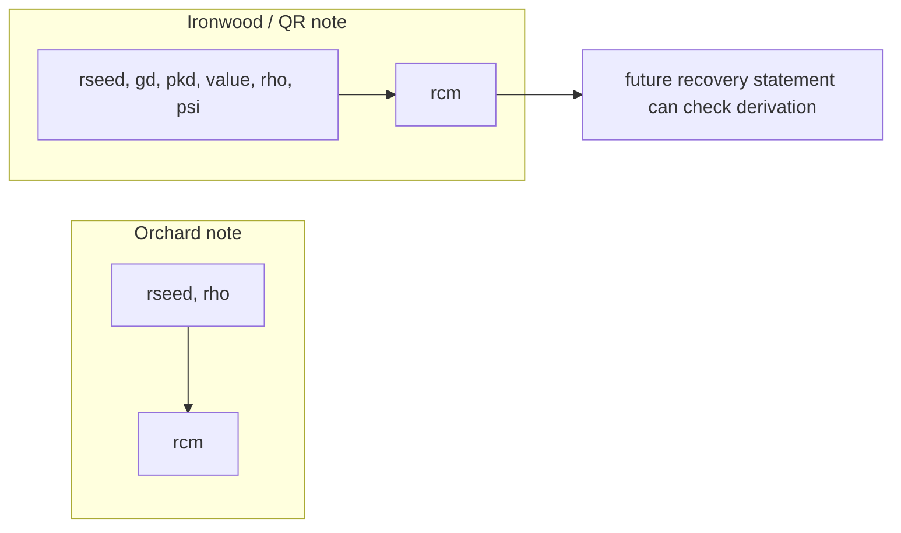

# Quantum Recoverability

Quantum recoverability is the note-level change that defines Ironwood notes. It
does not make the current Orchard-style protocol post-quantum. Instead, it
changes how new Orchard-style notes are created so they can be recovered into a
future shielded protocol if the current elliptic-curve-based protocol ever has
to be disabled.

The threat model is supply integrity. If an attacker can break discrete
logarithms on the curves used by Zcash, then the existing Sapling and Orchard
note commitments are not binding against that attacker. Even if Zcash later
upgraded its proof system and rebuilt note commitments with a post-quantum hash,
an attacker could otherwise try to forge a note that was not actually in the
commitment tree.

Quantum-recoverable notes address this by changing how note commitment
randomness is derived.

## Ironwood Notes

ZIP 2005 defines the Ironwood note plaintext format with lead byte `0x03`. This
is the quantum-recoverable note plaintext format.

Older Orchard notes use note plaintext lead byte `0x02`. For those notes, the note
commitment randomness is derived from `rseed` and the note position seed `rho`.

For Ironwood notes, the randomness is instead derived from the note contents. The
derivation binds the randomness to:

- the diversifier-derived point,
- the recipient public key,
- the note value,
- `rho`, and
- the note-specific `psi` value.

In effect, the note contents become part of the randomness derivation.

This makes it possible for a future recovery protocol to prove that a recovered
note corresponds to a real note with fixed contents, rather than to a forged
choice of note fields.

Ironwood outputs are Orchard-style notes using the Ironwood note plaintext
format. Ironwood still uses Orchard-shaped actions, receivers, and note
encryption. The distinction is that Ironwood notes use the QR note plaintext
format, are committed into the Ironwood note commitment tree, and are spent
against the Ironwood nullifier set.

## What This Does Not Do

Quantum recoverability is not a post-quantum shielded protocol by itself.

It does not:

- make current Orchard-style spends post-quantum secure,
- define the future recovery protocol in full,
- choose a future post-quantum proof system, or
- choose a future post-quantum note commitment tree.

It is a forward-compatibility change. The goal is to make funds created as
recoverable notes usable by a later recovery protocol, without requiring Zcash
to choose that future protocol today.

## Why This Matters For Ironwood

Ironwood is the pool where new Orchard-style shielded value goes after NU7.
Using Ironwood notes means new Ironwood funds are created in the recoverable
format from the start.

This gives Zcash a migration path: existing value can be moved into Ironwood,
and Ironwood notes are structured so that a future post-quantum transition has
the information it needs to recover those funds.

Further reading:

- [ZIP 2005: Orchard Quantum Recoverability](https://zips.z.cash/zip-2005)
