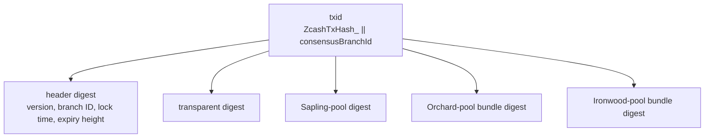
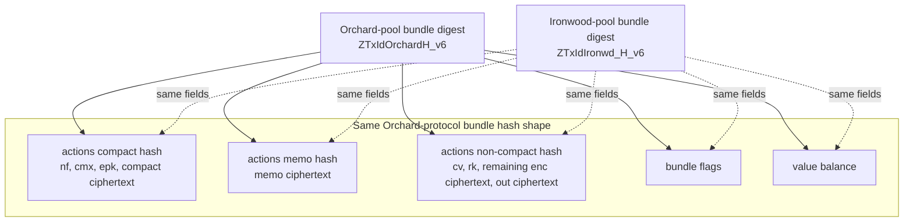

# Transaction Format

Version 6 follows the version 5 transaction format, with an *Ironwood-pool* bundle
added after the *Orchard-pool* bundle. Within version 6, the *Orchard-pool* bundle
keeps its version 5 layout but gains a new `enableCrossAddress` flag. See
[Orchard-Pool Bundle Changes in Version 6](../design.md#orchard-pool-bundle-changes-in-version-6).

At the transaction ID layer, the *Ironwood-pool* bundle is another child in the
transaction hash tree:

The *Orchard-pool* and *Ironwood-pool* bundle digests have the same structure. The
difference is that the *Ironwood-pool* bundle uses its own personalization strings
at each bundle-hash node:

The same rule applies to authorization hashing: the *Ironwood-pool* bundle follows
the *Orchard-pool* bundle authorization structure, but uses *Ironwood-pool*-specific
personalization strings.

In version 6 the bundle **anchor** is excluded from the txid bundle digest
shown above, and is instead committed in the **authorization digest**. This
keeps both the txid and the signature sighash independent of the anchor, so
that a spend can be signed before the anchor it is finalized against —the
note-commitment-tree root— exists.
