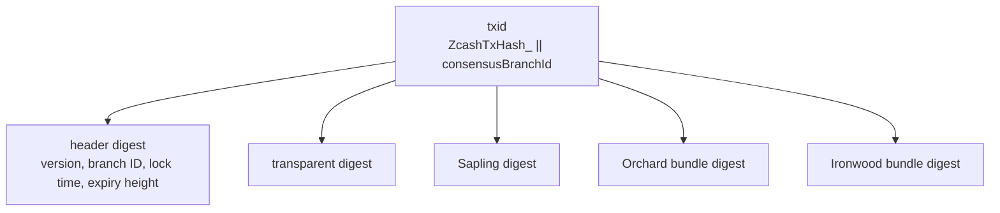
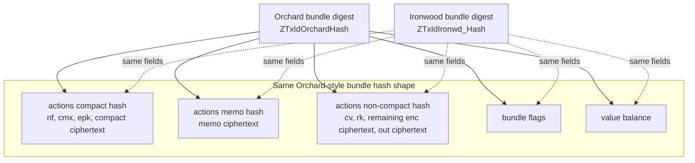

# Transaction Format

Version 6 follows the version 5 transaction format, with an Ironwood bundle
added after the Orchard bundle.

At the transaction ID layer, Ironwood is another child in the transaction hash
tree:

The Orchard and Ironwood bundle digests have the same structure. The difference
is that Ironwood uses its own personalization strings at each bundle-hash node:

The same rule applies to authorization hashing: Ironwood follows the Orchard
bundle authorization structure, but uses Ironwood-specific personalization
strings.

In version 6 the bundle **anchor** is excluded from the txid bundle digest
shown above, and is instead committed in the **authorization digest**. This
keeps both the txid and the signature sighash independent of the anchor, so a
spend can be signed before the anchor it is finalized against — the
note-commitment-tree root — exists.
