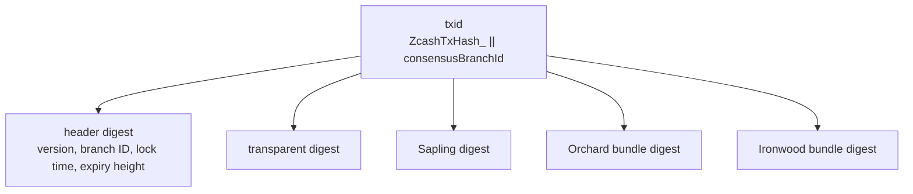
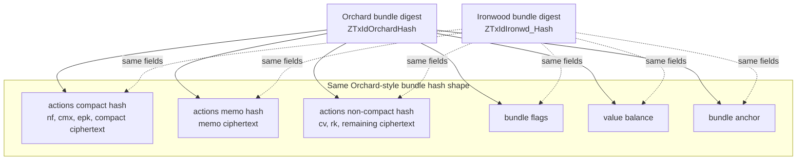

# Transaction Format

Version 6 follows the version 5 transaction format, with an Ironwood bundle
added after the Orchard bundle.

At the transaction ID layer, Ironwood is another child in the transaction hash
tree:

The Orchard and Ironwood bundle digests have the same structure. The difference
is that Ironwood uses its own personalization strings at each bundle-hash node:

The same rule applies to authorization hashing: Ironwood follows the Orchard
bundle authorization structure, but uses Ironwood-specific personalization
strings.
